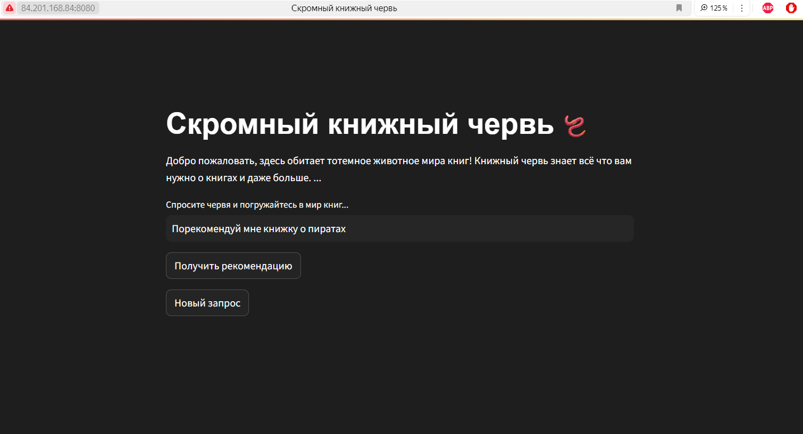
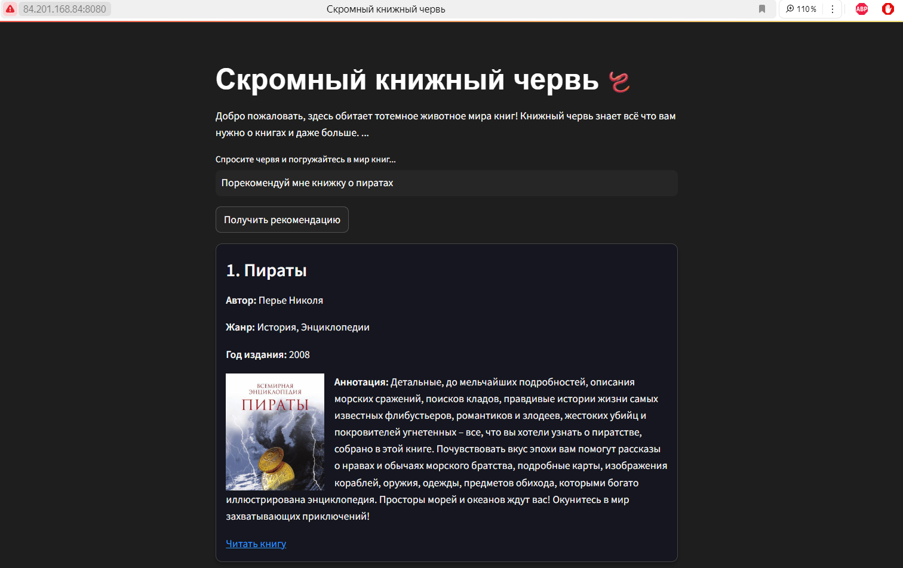

# Скромный книжный червь

**Скромный книжный червь** - это сервис для помощи в поиске книг. Этот проект предназначен для тех, кто не знает что почитать. Червь предоставит рекомендации по запросу пользователя, а также выдаст информацию (название, автора, год издания и аннотацию) о книге и ссылку, где можно её прочесть. 

Червь использует обширную базу литературных источников и книжных архивов для создания полезных рекомендаций по пользовательским запросам.

### Демонстрация сервиса доступна по [ссылке](http://84.201.168.84:8080/)

## Функциональные возможности червя

- Создание **топ-3** рекомендаций литературы на основе запроса пользователя
- Предоставление информации о рекомендованных книгах 
- Предоставление **ссылок на источник**, где можно скачать книги или прочитать их онлайн

## Технологии

- [База данных MySQL для первоначального сбора информации и библиотека FAISS](docs/data.md) 
- [Модели RAG для обработки и генерации текста](docs/rag.md)
- [Интеграция LLM](docs/llm.md)
- [Пакет Ragas для оценки качества RAG-архитектуры](docs/metric.md)
- [Streamlit для создания интерфейса](docs/streamlit.md)

## Пример использования червя



## Развертывание в Яндекс.Облаке:
1) Хостинг приложения:
- Развертывание Streamlit-приложения в Docker-контейнере.
- Установлен порт 8080
2) Хранение обложек:
- Использование S3-бакета для хранения изображений.
- Преимущества:
  - Уменьшение размера Docker-образа.
  - Высокая доступность данных.
## Как запустить проект локально

1. Клонировать репозиторий: <br>
```git clone https://github.com/MadBunny999/ITMO_LLMcourse.git``` <br>
2. Внести в файл .env токен для GigaChat-Pro <br>
3. [Скачать файлы](https://disk.yandex.ru/d/FiTvPB7n1gjggw/faiss_index) `index.faiss` и `index.pkl`, разместить их в папке faiss_index <br>
4. Выполнить код: <br>
```streamlit run app.py``` <br>
5. Приложение будет доступно по адресу Local URL: <br>
http://localhost:8501

## Команда проекта
Состав команды **Connoisseurs-of-Fiction**:
- [Боярская Эмилия Евгеньевна](https://github.com/alexmackfi)
- [Бондаренко Дарья Николаевна](https://github.com/MadBunny999)
