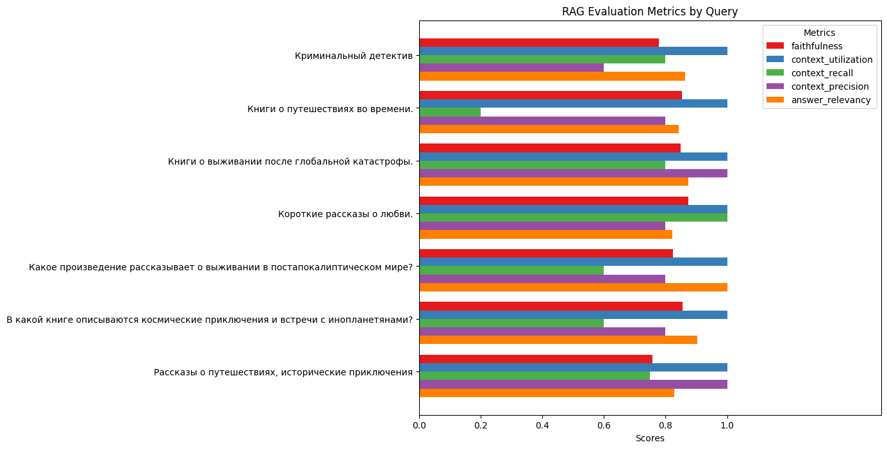
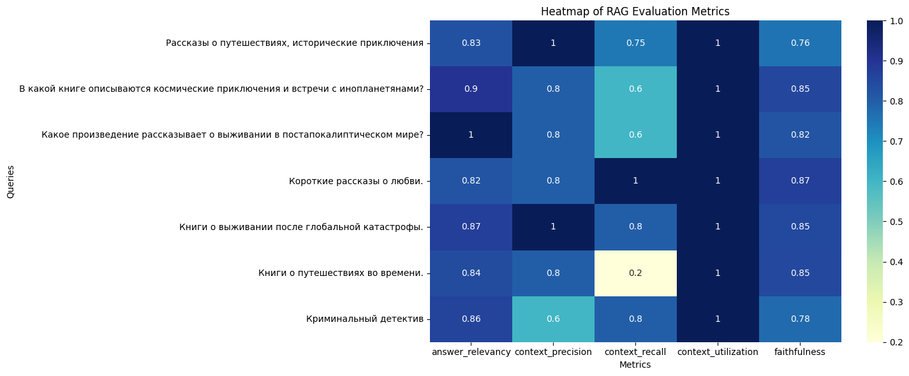

## 1) Валидация
- Инструменты: Использовался [пакет Ragas](https://habr.com/ru/articles/787940/) для оценки качества RAG-архитектуры.
- [Метрики](../validation.ipynb):

## 2) Проблемы:
> Низкие значения Context Recall связаны с короткими и малоинформативными аннотациями книг
